# Udaydev Patan Premier League (UPPL) — Client Delivery Documentation

---

| Document Version | 1.0 |
|---|---|
| Last Updated | June 2026 |
| Document Type | Client Handover & Technical Documentation |
| Prepared For | UPPL Management / Tournament Committee |
| Prepared By | [Your Name / Agency Name] |
| Classification | Confidential |

---

## Table of Contents

1. [Executive Summary](#1-executive-summary)
2. [Project Overview](#2-project-overview)
3. [Technology Stack](#3-technology-stack)
4. [System Architecture](#4-system-architecture)
5. [Database Design](#5-database-design)
6. [Feature Matrix](#6-feature-matrix)
7. [User & Admin Workflows](#7-user--admin-workflows)
8. [Security Architecture](#8-security-architecture)
9. [Cost Breakdown](#9-cost-breakdown)
10. [Deployment Guide](#10-deployment-guide)
11. [Maintenance Plan](#11-maintenance-plan)
12. [Handover Checklist](#12-handover-checklist)
13. [Appendices](#13-appendices)

---

## 1. Executive Summary

### 1.1 Project Brief

**UPPL (Udaydev Patan Premier League)** is a full-stack, production-ready web application designed to manage and showcase a T20-format cricket tournament. The platform handles the complete lifecycle of a cricket league — from team registrations and player verifications to live ball-by-ball scoring, automated points table calculation, and content management.

### 1.2 Key Capabilities

| Capability | Description |
|---|---|
| **Tournament Lifecycle Management** | Seasons, team registration, group generation, fixture scheduling |
| **Live Scoring Engine** | Professional-grade ball-by-ball scoring with real-time broadcast via WebSocket |
| **Content Management** | News (rich text editor), photo gallery, video highlights |
| **Financial Integration** | eSewa payment gateway for registration fees |
| **User Engagement** | Match predictions, player voting, career statistics tracking |
| **Admin Control** | Full administrative dashboard with user, team, match, and content management |

### 1.3 Delivery Summary

| Metric | Value |
|---|---|
| **Total Development Hours** | ~825 hours |
| **Frontend Components** | 50+ pages & components |
| **Backend APIs** | 80+ RESTful endpoints |
| **Database Collections** | 18 Mongoose models |
| **Third-party Integrations** | 7 services (MongoDB, Cloudinary, Firebase, eSewa, NewsAPI, Nodemailer, Socket.IO) |
| **Deployment Status** | Ready for production hosting |

---

## 2. Project Overview

### 2.1 What is UPPL?

UPPL is a web-based tournament management platform built for the **Udaydev Patan Premier League**, a local T20 cricket tournament. It replaces manual paper-based management with a digital platform that handles:

- Online team registration with payment
- Player identity verification
- Automated group and fixture generation
- Real-time live scoring (ball-by-ball)
- Auto-calculated points table with Net Run Rate
- News, photo gallery, and video highlights
- Sponsor showcase with tiered display

### 2.2 Target Users

| User Role | Description | Access Level |
|---|---|---|
| **Super Admin** | Full system control | All features |
| **Admin** | Tournament management | Admin features except user deletion |
| **Player** | Verified cricket player | Profile, stats, predictions |
| **User** | General authenticated user | Registration, predictions, voting |
| **Visitor** | Unauthenticated guest | View-only (public pages) |

### 2.3 Key Business Value

1. **Digitization** — Eliminates paper-based registration and scoring
2. **Transparency** — Live scores, real-time standings, verified player data
3. **Revenue** — eSewa payment collection, digital sponsorship tiers
4. **Engagement** — Fans can predict matches, vote for best players
5. **Archive** — Tournament history preserved with stats, photos, videos

---

## 3. Technology Stack

### 3.1 Technology Overview

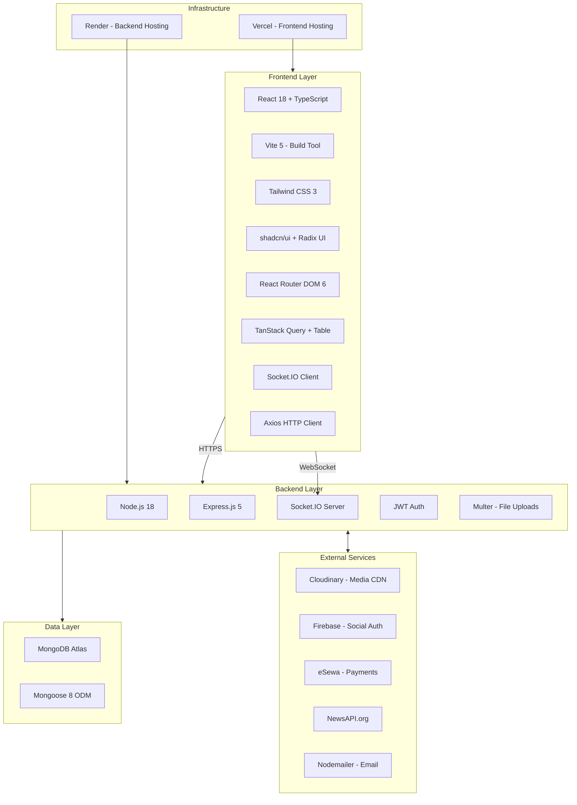
```mermaid
graph TB
    subgraph FRONTEND["Frontend Layer"]
        REACT["React 18 + TypeScript"]
        VITE["Vite 5 - Build Tool"]
        TAILWIND["Tailwind CSS 3"]
        SHADCN["shadcn/ui + Radix UI"]
        ROUTER["React Router DOM 6"]
        TANSTACK["TanStack Query + Table"]
        SOCKET_CLIENT["Socket.IO Client"]
        AX["Axios HTTP Client"]
    end

    subgraph BACKEND["Backend Layer"]
        NODE["Node.js 18"]
        EXP["Express.js 5"]
        SOCKET_SRV["Socket.IO Server"]
        JWT["JWT Auth"]
        MULTER["Multer - File Uploads"]
    end

    subgraph DATABASE["Data Layer"]
        MONGO["MongoDB Atlas"]
        MONGOOSE["Mongoose 8 ODM"]
    end

    subgraph EXTERNAL["External Services"]
        CLOUDINARY["Cloudinary - Media CDN"]
        FIREBASE["Firebase - Social Auth"]
        ESEWA["eSewa - Payments"]
        NEWSAPI["NewsAPI.org"]
        NODEMAILER["Nodemailer - Email"]
    end

    subgraph DEPLOY["Infrastructure"]
        VERCEL["Vercel - Frontend Hosting"]
        RENDER["Render - Backend Hosting"]
    end

    FRONTEND -->|HTTPS| BACKEND
    BACKEND --> DATABASE
    BACKEND <--> EXTERNAL
    FRONTEND -->|WebSocket| SOCKET_SRV
    VERCEL --> FRONTEND
    RENDER --> BACKEND
```

### 3.2 Detailed Technology Stack

#### 3.2.1 Frontend Technologies

| Category | Technology | Version | Purpose |
|---|---|---|---|
| **Core** | React | 18.x | UI framework |
| **Language** | TypeScript | 5.x | Type safety |
| **Build** | Vite | 5.x | Fast dev server & bundling |
| **Styling** | Tailwind CSS | 3.x | Utility-first CSS |
| **UI Components** | shadcn/ui + Radix UI | Latest | Accessible component library |
| **Advanced UI** | Material UI (MUI) | 7.x | Data grids, complex components |
| **Routing** | React Router DOM | 6.x | Client-side routing |
| **State/Data** | TanStack React Query | 5.x | Server state & caching |
| **Tables** | TanStack React Table | 8.x | Sortable, filterable tables |
| **Forms** | React Hook Form + Zod | Latest | Form handling & validation |
| **Rich Text** | TipTap | Latest | News article editor |
| **Charts** | Recharts | 2.x | Statistics visualization |
| **Animations** | Framer Motion | 11.x | Page transitions & animations |
| **Real-time** | Socket.IO Client | 4.x | Live score updates |
| **Auth** | Firebase SDK | 10.x | Google/Facebook OAuth |
| **HTTP** | Axios | 1.x | API communication |
| **Date** | date-fns + dayjs | Latest | Date formatting & manipulation |
| **Carousel** | Swiper + Embla | Latest | Image galleries |
| **Icons** | Lucide React + React Icons | Latest | UI icons |
| **Export** | html2canvas + jspdf | Latest | PDF/image export |

#### 3.2.2 Backend Technologies

| Category | Technology | Version | Purpose |
|---|---|---|---|
| **Runtime** | Node.js | 18.x | JavaScript runtime |
| **Framework** | Express.js | 5.x | Web server & routing |
| **Database** | MongoDB (Atlas) | 7.x | NoSQL document database |
| **ODM** | Mongoose | 8.x | MongoDB object modeling |
| **Authentication** | jsonwebtoken + bcryptjs | Latest | JWT tokens & password hashing |
| **Real-time** | Socket.IO | 4.x | WebSocket server |
| **File Upload** | Multer | 1.x | Temporary file handling |
| **Media CDN** | Cloudinary SDK | Latest | Image/video upload & transformation |
| **Email** | Nodemailer | 6.x | Email sending (Gmail SMTP) |
| **Scheduling** | node-cron | 3.x | Cron jobs (news fetch, cleanup) |
| **Security** | Helmet + CORS | Latest | HTTP security headers |
| **Logging** | Morgan | 1.x | HTTP request logging |
| **HTTP Client** | Axios | 1.x | Outbound API requests |
| **Google Auth** | google-auth-library | Latest | Google token verification |

#### 3.2.3 Infrastructure & Services

| Service | Plan | Monthly Cost | Purpose |
|---|---|---|---|
| **MongoDB Atlas** | M0 (Free) / M2 | $0–$15 | Managed MongoDB database |
| **Cloudinary** | Free | $0 | Media storage, CDN, transformations |
| **Vercel** | Hobby | $0 | Frontend hosting & CDN |
| **Render** | Free / Starter | $0–$7 | Backend hosting |
| **Firebase** | Spark (Free) | $0 | Google/Facebook OAuth |
| **NewsAPI** | Developer (Free) | $0 | External cricket news |
| **Gmail SMTP** | Free | $0 | Transactional emails |
| **Custom Domain** | — | ~$1.25/mo | Branding URL |

---

## 4. System Architecture

### 4.1 High-Level Architecture

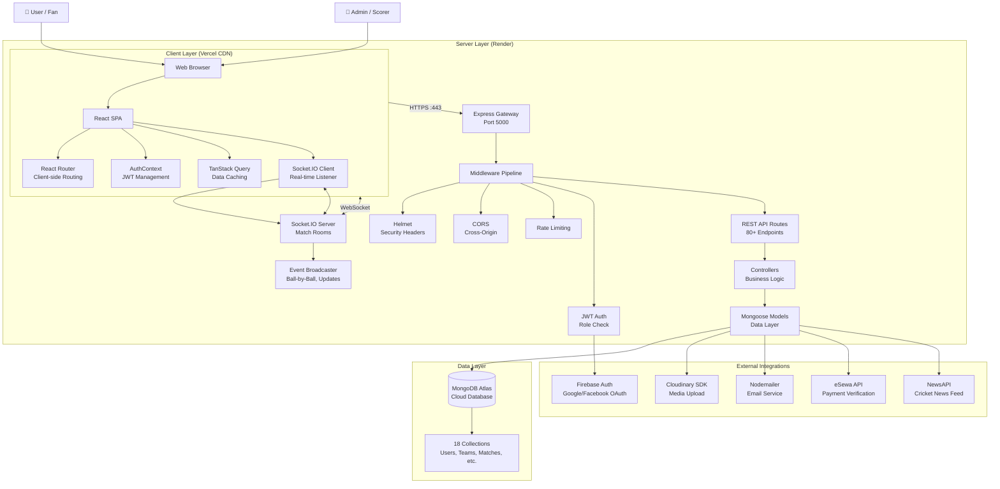
```mermaid
graph TB
    USER["👤 User / Fan"] --> BROWSER["Web Browser"]
    ADMIN["🔧 Admin / Scorer"] --> BROWSER

    subgraph CLIENT["Client Layer (Vercel CDN)"]
        BROWSER --> REACT_SPA["React SPA"]
        REACT_SPA --> ROUTER["React Router\nClient-side Routing"]
        REACT_SPA --> AUTH_CTX["AuthContext\nJWT Management"]
        REACT_SPA --> TANSTACK["TanStack Query\nData Caching"]
        REACT_SPA --> SOCKET_IO["Socket.IO Client\nReal-time Listener"]
    end

    subgraph SERVER["Server Layer (Render)"]
        CLIENT -->|HTTPS :443| NGINX["Express Gateway\nPort 5000"]
        NGINX --> MIDDLEWARE["Middleware Pipeline"]
        MIDDLEWARE --> HELMET["Helmet\nSecurity Headers"]
        MIDDLEWARE --> CORS["CORS\nCross-Origin"]
        MIDDLEWARE --> RATE_LIMIT["Rate Limiting"]
        MIDDLEWARE --> AUTH["JWT Auth\nRole Check"]

        MIDDLEWARE --> ROUTES["REST API Routes\n80+ Endpoints"]
        ROUTES --> CONTROLLERS["Controllers\nBusiness Logic"]
        CONTROLLERS --> MODELS["Mongoose Models\nData Layer"]

        SOCKET_IO --> WS_SERVER["Socket.IO Server\nMatch Rooms"]
        WS_SERVER --> EMIT["Event Broadcaster\nBall-by-Ball, Updates"]
    end

    subgraph DATA["Data Layer"]
        MODELS --> MONGO_DB[("MongoDB Atlas\nCloud Database")]
        MONGO_DB --> COLLECTIONS["18 Collections\nUsers, Teams, Matches, etc."]
    end

    subgraph EXTERNAL["External Integrations"]
        MODELS --> CLOUDINARY_SDK["Cloudinary SDK\nMedia Upload"]
        MODELS --> NODEMAILER_SDK["Nodemailer\nEmail Service"]
        MODELS --> ESEWA_API["eSewa API\nPayment Verification"]
        MODELS --> NEWSAPI_SDK["NewsAPI\nCricket News Feed"]
        AUTH --> FIREBASE_AUTH["Firebase Auth\nGoogle/Facebook OAuth"]
    end

    SOCKET_IO <--> WS_SERVER
    CLIENT <-->|WebSocket| WS_SERVER
```

### 4.2 Data Flow Architecture

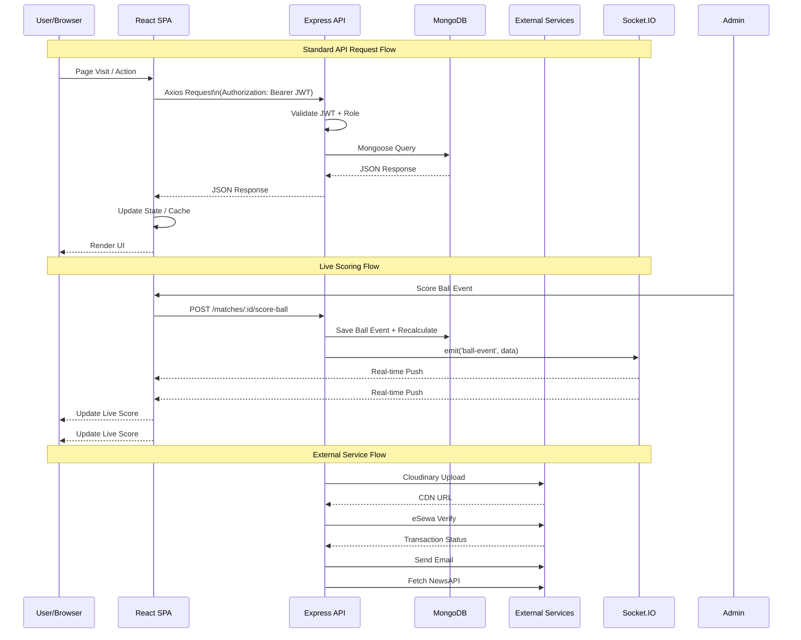
```mermaid
sequenceDiagram
    participant User as User/Browser
    participant React as React SPA
    participant API as Express API
    participant DB as MongoDB
    participant Ext as External Services
    participant WS as Socket.IO

    Note over User,WS: Standard API Request Flow
    User->>React: Page Visit / Action
    React->>API: Axios Request\n(Authorization: Bearer JWT)
    API->>API: Validate JWT + Role
    API->>DB: Mongoose Query
    DB-->>API: JSON Response
    API-->>React: JSON Response
    React->>React: Update State / Cache
    React-->>User: Render UI

    Note over User,WS: Live Scoring Flow
    Admin->>React: Score Ball Event
    React->>API: POST /matches/:id/score-ball
    API->>DB: Save Ball Event + Recalculate
    API->>WS: emit('ball-event', data)
    WS-->>React: Real-time Push
    WS-->>React: Real-time Push
    React-->>User: Update Live Score
    React-->>User: Update Live Score

    Note over User,WS: External Service Flow
    API->>Ext: Cloudinary Upload
    Ext-->>API: CDN URL
    API->>Ext: eSewa Verify
    Ext-->>API: Transaction Status
    API->>Ext: Send Email
    API->>Ext: Fetch NewsAPI
```

### 4.3 Component Diagram

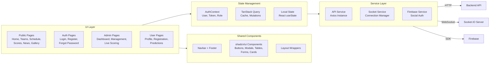
```mermaid
graph LR
    subgraph UI["UI Layer"]
        PUBLIC["Public Pages\nHome, Teams, Schedule,\nScores, News, Gallery"]
        AUTH["Auth Pages\nLogin, Register,\nForgot Password"]
        ADMIN["Admin Pages\nDashboard, Management,\nLive Scoring"]
        USER["User Pages\nProfile, Registration,\nPredictions"]
    end

    subgraph COMP["Shared Components"]
        NAV["Navbar + Footer"]
        UI_KIT["shadcn/ui Components\nButtons, Modals, Tables,\nForms, Cards"]
        LAYOUT["Layout Wrappers"]
    end

    subgraph STATE["State Management"]
        AUTH_CTX["AuthContext\nUser, Token, Role"]
        QUERY["TanStack Query\nCache, Mutations"]
        LOCAL["Local State\nReact useState"]
    end

    subgraph SERVICES["Service Layer"]
        API_SVC["API Service\nAxios Instance"]
        SOCKET_SVC["Socket Service\nConnection Manager"]
        FIREBASE_SVC["Firebase Service\nSocial Auth"]
    end

    UI --> COMP
    UI --> STATE
    STATE --> SERVICES
    SERVICES -->|HTTP| BACKEND["Backend API"]
    SERVICES -->|WebSocket| SOCKET_BACKEND["Socket.IO Server"]
    SERVICES -->|SDK| FIREBASE_INT["Firebase"]
```

### 4.4 Request-Response Lifecycle

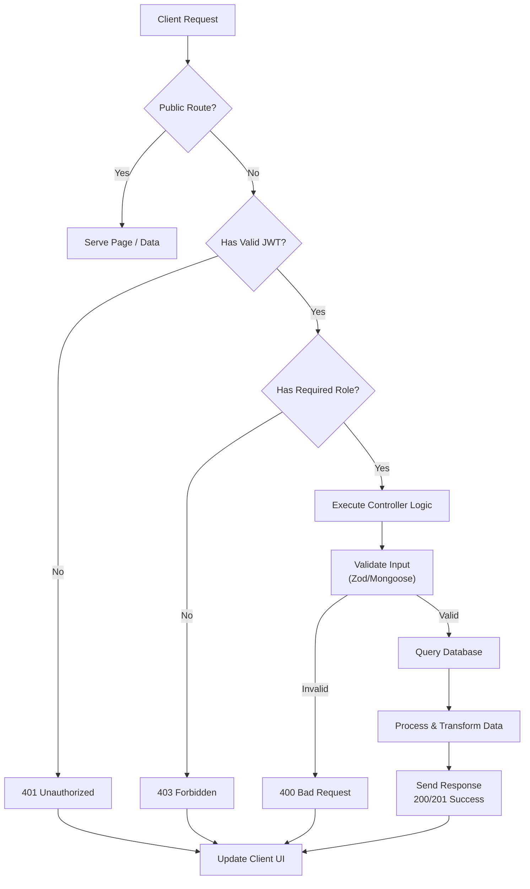
```mermaid
flowchart TD
    A["Client Request"] --> B{"Public Route?"}
    B -->|Yes| C["Serve Page / Data"]
    B -->|No| D{"Has Valid JWT?"}
    D -->|No| E["401 Unauthorized"]
    D -->|Yes| F{"Has Required Role?"}
    F -->|No| G["403 Forbidden"]
    F -->|Yes| H["Execute Controller Logic"]
    H --> I["Validate Input\n(Zod/Mongoose)"]
    I -->|Invalid| J["400 Bad Request"]
    I -->|Valid| K["Query Database"]
    K --> L["Process & Transform Data"]
    L --> M["Send Response\n200/201 Success"]
    M --> N["Update Client UI"]

    E --> N
    G --> N
    J --> N
```

---

## 5. Database Design

### 5.1 Entity Relationship Diagram

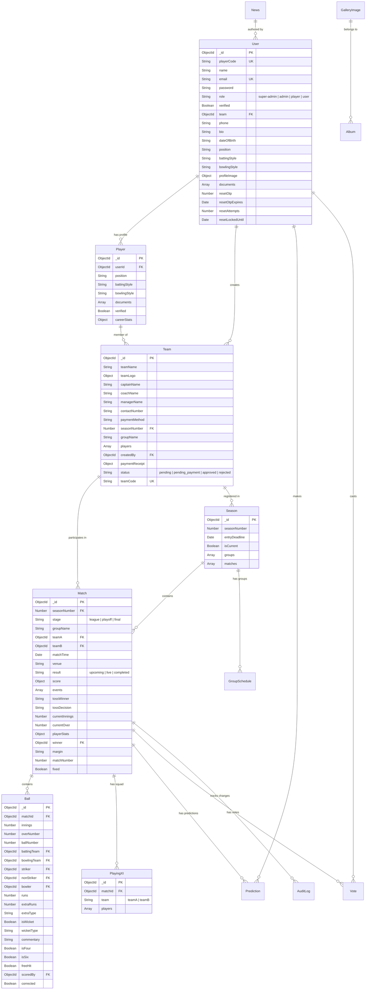
```mermaid
erDiagram
    User ||--o{ Player : "has profile"
    User ||--o{ Team : "creates"
    User ||--o{ Prediction : "makes"
    User ||--o{ Vote : "casts"
    Player ||--o{ Team : "member of"
    Team ||--o{ Match : "participates in"
    Team ||--o{ Season : "registered in"
    Season ||--o{ Match : "contains"
    Season ||--o{ GroupSchedule : "has groups"
    Match ||--o{ Ball : "contains"
    Match ||--o{ PlayingXI : "has squad"
    Match ||--o{ Prediction : "has predictions"
    Match ||--o{ Vote : "has votes"
    Match ||--o{ AuditLog : "tracks changes"
    GalleryImage ||--o{ Album : "belongs to"
    News ||--o{ User : "authored by"

    User {
        ObjectId _id PK
        String playerCode UK
        String name
        String email UK
        String password
        String role "super-admin | admin | player | user"
        Boolean verified
        ObjectId team FK
        String phone
        String bio
        String dateOfBirth
        String position
        String battingStyle
        String bowlingStyle
        Object profileImage
        Array documents
        Number resetOtp
        Date resetOtpExpires
        Number resetAttempts
        Date resetLockedUntil
    }

    Player {
        ObjectId _id PK
        ObjectId userId FK
        String position
        String battingStyle
        String bowlingStyle
        Array documents
        Boolean verified
        Object careerStats
    }

    Team {
        ObjectId _id PK
        String teamName
        Object teamLogo
        String captainName
        String coachName
        String managerName
        String contactNumber
        String paymentMethod
        Number seasonNumber FK
        String groupName
        Array players
        ObjectId createdBy FK
        Object paymentReceipt
        String status "pending | pending_payment | approved | rejected"
        String teamCode UK
    }

    Season {
        ObjectId _id PK
        Number seasonNumber
        Date entryDeadline
        Boolean isCurrent
        Array groups
        Array matches
    }

    Match {
        ObjectId _id PK
        Number seasonNumber FK
        String stage "league | playoff | final"
        String groupName
        ObjectId teamA FK
        ObjectId teamB FK
        Date matchTime
        String venue
        String result "upcoming | live | completed"
        Object score
        Array events
        String tossWinner
        String tossDecision
        Number currentInnings
        Number currentOver
        Object playerStats
        ObjectId winner FK
        String margin
        Number matchNumber
        Boolean fixed
    }

    Ball {
        ObjectId _id PK
        ObjectId matchId FK
        Number innings
        Number overNumber
        Number ballNumber
        ObjectId battingTeam FK
        ObjectId bowlingTeam FK
        ObjectId striker FK
        ObjectId nonStriker FK
        ObjectId bowler FK
        Number runs
        Number extraRuns
        String extraType
        Boolean isWicket
        String wicketType
        String commentary
        Boolean isFour
        Boolean isSix
        Boolean freeHit
        ObjectId scoredBy FK
        Boolean corrected
    }

    PlayingXI {
        ObjectId _id PK
        ObjectId matchId FK
        String team "teamA | teamB"
        Array players
    }
```

### 5.2 Collection Summary

| # | Collection | Key Fields | Purpose | Relationships |
|---|---|---|---|---|
| 1 | **User** | name, email, role, verified, profileImage | Authentication & user management | → Team, Player, Prediction, Vote |
| 2 | **Player** | userId, careerStats, verified | Player profiles with career statistics | → User (1:1) |
| 3 | **Team** | teamName, seasonNumber, groupName, status | Team registration & management | → User, Season, Match |
| 4 | **Season** | seasonNumber, entryDeadline, groups, matches | Tournament season management | → Team, Match, GroupSchedule |
| 5 | **Match** | seasonNumber, stage, teamA/B, score, result | Match management & live scoring | → Season, Team, Ball, PlayingXI |
| 6 | **Ball** | matchId, innings, overNumber, ballNumber, runs | Ball-by-ball event tracking | → Match |
| 7 | **PlayingXI** | matchId, team, players | Playing XI setup per match | → Match |
| 8 | **News** | title, slug, content, status, source | News articles (internal + external) | → User (author) |
| 9 | **GalleryImage** | title, image, album | Photo gallery images | → Album |
| 10 | **Album** | name, description, season, isPublic | Photo album grouping | → GalleryImage |
| 11 | **Video** | title, url, type, active | Video highlights | — |
| 12 | **OrganizationSponsor** | name, donationAmount, tier, logo | Organization sponsors | — |
| 13 | **IndividualSponsor** | name, donationAmount, tier, avatar | Individual sponsors | — |
| 14 | **PaymentQR** | url, public_id | eSewa payment QR codes | — |
| 15 | **Prediction** | userId, matchId, predictedWinnerId | Match winner predictions | → User, Match |
| 16 | **Vote** | userId, matchId, playerId | Player-of-the-match voting | → User, Match |
| 17 | **AuditLog** | matchId, action, adminId, old/newData | Admin action audit trail | → Match, User |
| 18 | **GroupSchedule** | seasonNumber, groups, scheduleGenerationTime | Group allocation & schedule | → Season |
| 19 | **TeamMember** | name, position, avatar | Organization committee members | — |

### 5.3 Indexing Strategy

| Collection | Indexed Fields | Purpose |
|---|---|---|
| User | `email` (unique) | Fast login lookup |
| User | `role` | Role-based queries |
| Team | `teamCode` (unique) | Unique team identification |
| Team | `seasonNumber` | Season-based filtering |
| Team | `status` | Pending/approved filtering |
| Match | `seasonNumber` | Season-based queries |
| Match | `result` | Upcoming/live/completed filtering |
| Match | `matchTime` | Schedule ordering |
| Ball | `matchId` | Match event lookup |
| Ball | `{ matchId, innings, overNumber }` | Over-based queries |
| News | `slug` (unique) | SEO-friendly URL lookup |
| News | `status` | Published/draft filtering |
| Season | `seasonNumber` (unique) | Season lookup |
| Season | `isCurrent` | Current season retrieval |

---

## 6. Feature Matrix

### 6.1 Complete Feature Inventory

#### Public Features (All Visitors)

| ID | Feature | Module | Description | Complexity | Status |
|---|---|---|---|---|---|
| F1 | Home Page | Core | Hero section, tournament stats, latest updates, sponsor showcase | ★★ | ✅ |
| F2 | Teams Directory | Teams | Browse all registered teams with logos, captains, coaches | ★★ | ✅ |
| F3 | Team Squad | Teams | View full player roster per team with roles | ★★ | ✅ |
| F4 | Match Schedule | Matches | Full fixture list with dates, venues, stages | ★★★ | ✅ |
| F5 | Match Details | Matches | Scorecard, ball-by-ball commentary, player stats | ★★★ | ✅ |
| F6 | Live Scores | Matches | Real-time ball-by-ball scoring display | ★★★★★ | ✅ |
| F7 | Points Table | Standings | Group-wise standings with NRR calculation | ★★★★ | ✅ |
| F8 | News Section | Content | Internal articles + external cricket news feed | ★★★ | ✅ |
| F9 | News Article | Content | Rich-text article with images, tags, recommendations | ★★ | ✅ |
| F10 | Photo Gallery | Content | Albums with grid view, fullscreen lightbox | ★★★ | ✅ |
| F11 | Videos Page | Content | Embedded YouTube/Vimeo highlights grid | ★★ | ✅ |
| F12 | Sponsors Page | Sponsors | Tiered display (Platinum/Gold/Silver/Bronze) | ★★ | ✅ |
| F13 | Players Directory | Players | All verified players with career stats, search | ★★★ | ✅ |
| F14 | Tournament Stats | Stats | Aggregate charts (runs, wickets, sixes, etc.) | ★★★ | ✅ |
| F15 | Watch Live | Media | Live streaming / broadcast page | ★ | ✅ |

#### Authentication Features

| ID | Feature | Module | Description | Complexity | Status |
|---|---|---|---|---|---|
| F16 | User Registration | Auth | Register with name, email, password, profile image | ★★ | ✅ |
| F17 | User Login | Auth | Email/password login with JWT | ★★ | ✅ |
| F18 | Google Login | Auth | OAuth login via Google | ★★★ | ✅ |
| F19 | Facebook Login | Auth | OAuth login via Facebook | ★★★ | ✅ |
| F20 | Forgot Password | Auth | OTP-based password reset flow | ★★★ | ✅ |
| F21 | User Profile | Auth | View/edit profile, change password, view stats | ★★ | ✅ |

#### Tournament Management

| ID | Feature | Module | Description | Complexity | Status |
|---|---|---|---|---|---|
| F22 | Team Registration | Tournaments | Multi-step form: team info, logo upload, payment | ★★★ | ✅ |
| F23 | Season Management | Tournaments | Create/activate/expire tournament seasons | ★★ | ✅ |
| F24 | Group Generation | Tournaments | Auto-allocate teams into groups (shuffle algorithm) | ★★★★ | ✅ |
| F25 | Schedule Generation | Tournaments | Auto-generate league fixtures | ★★★★ | ✅ |
| F26 | Team Approval | Tournaments | Approve/reject team registrations | ★★ | ✅ |
| F27 | Player Verification | Tournaments | Verify player identity with document upload | ★★★ | ✅ |

#### Admin Dashboard & Management

| ID | Feature | Module | Description | Complexity | Status |
|---|---|---|---|---|---|
| F28 | Admin Dashboard | Admin | Stats: users, teams, matches, revenue, charts | ★★★ | ✅ |
| F29 | User Management | Admin | CRUD users, assign roles (super-admin/admin/user) | ★★★ | ✅ |
| F30 | Team Management | Admin | Edit/delete teams, approve/reject | ★★★ | ✅ |
| F31 | Match Management | Admin | Create/edit/delete matches, set results | ★★★ | ✅ |
| F32 | News Management | Admin | Create/edit/delete with TipTap editor, schedule | ★★★ | ✅ |
| F33 | Gallery Management | Admin | Albums, image upload, drag-and-drop reorder | ★★★ | ✅ |
| F34 | Video Management | Admin | Add/edit/delete YouTube/Vimeo embeds | ★★ | ✅ |
| F35 | Sponsor Management | Admin | Organization & individual sponsors with tiering | ★★★ | ✅ |
| F36 | Payment QR Management | Admin | Upload/manage eSewa QR codes | ★★ | ✅ |
| F37 | Settings | Admin | Season config, deadlines, general settings | ★★ | ✅ |
| F38 | Team Members | Admin | Manage committee/organization members | ★★ | ✅ |

#### Live Scoring Engine

| ID | Feature | Module | Description | Complexity | Status |
|---|---|---|---|---|---|
| F39 | Playing XI Setup | Scoring | Select 11 players per team, assign roles | ★★★★ | ✅ |
| F40 | Toss Management | Scoring | Toss winner, decide bat/field | ★★★ | ✅ |
| F41 | Ball Scoring | Scoring | Runs (0-6), extras (wide, no-ball, bye, leg-bye), wickets | ★★★★★ | ✅ |
| F42 | Over Management | Scoring | Legal ball tracking, over completion, bowler change | ★★★★ | ✅ |
| F43 | Innings Management | Scoring | Start/end innings, auto-switch | ★★★ | ✅ |
| F44 | Powerplay Tracking | Scoring | Mandatory powerplay overs tracking | ★★★ | ✅ |
| F45 | Undo with Recalc | Scoring | Undo last ball with full recalculation | ★★★★★ | ✅ |
| F46 | Real-time Broadcast | Scoring | Socket.IO push to all connected clients | ★★★★ | ✅ |
| F47 | Audit Logging | Scoring | All scoring actions logged with admin identity | ★★★ | ✅ |

#### Payments & Engagement

| ID | Feature | Module | Description | Complexity | Status |
|---|---|---|---|---|---|
| F48 | eSewa Integration | Payments | Online payment via eSewa gateway | ★★★★ | ✅ |
| F49 | Payment Verification | Payments | Server-side signature verification | ★★★★ | ✅ |
| F50 | Match Predictions | Engagement | Users predict match winners | ★★ | ✅ |
| F51 | Player Voting | Engagement | Vote for player of the match | ★★ | ✅ |
| F52 | Email Notifications | Engagement | Verification/rejection emails | ★★ | ✅ |

#### Automation

| ID | Feature | Module | Description | Complexity | Status |
|---|---|---|---|---|---|
| F53 | Auto Group Scheduler | Automation | Auto-generate groups after deadline | ★★★ | ✅ |
| F54 | Auto News Fetcher | Automation | Fetch cricket news at 6 AM / 6 PM Nepal time | ★★★ | ✅ |
| F55 | Expired News Cleanup | Automation | Delete external news older than 2 days | ★★ | ✅ |

### 6.2 Feature Implementation Status

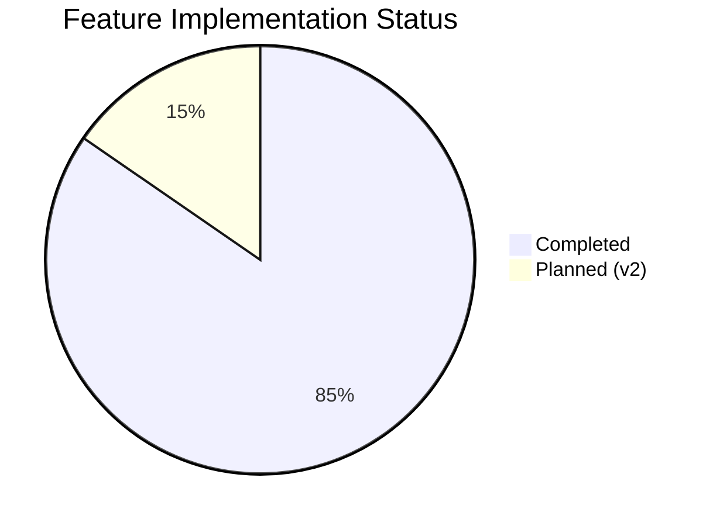
```mermaid
pie title Feature Implementation Status
    "Completed" : 55
    "Planned (v2)" : 10
```

---

## 7. User & Admin Workflows

### 7.1 User Registration & Authentication Workflow

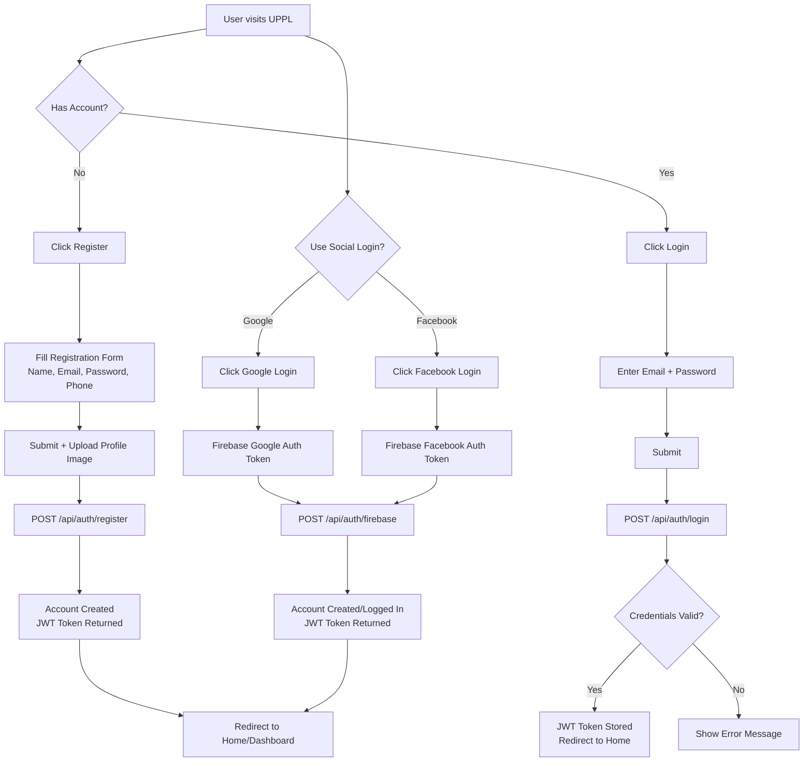
```mermaid
flowchart TD
    START["User visits UPPL"] --> CHOICE{"Has Account?"}
    CHOICE -->|No| REG["Click Register"]
    CHOICE -->|Yes| LOGIN["Click Login"]

    REG --> REG_FORM["Fill Registration Form\nName, Email, Password, Phone"]
    REG_FORM --> REG_SUBMIT["Submit + Upload Profile Image"]
    REG_SUBMIT --> REG_API["POST /api/auth/register"]
    REG_API --> REG_SUCCESS["Account Created\nJWT Token Returned"]
    REG_SUCCESS --> DASHBOARD["Redirect to Home/Dashboard"]

    LOGIN --> LOGIN_FORM["Enter Email + Password"]
    LOGIN_FORM --> LOGIN_SUBMIT["Submit"]
    LOGIN_SUBMIT --> LOGIN_API["POST /api/auth/login"]
    LOGIN_API --> CHECK_CRED{"Credentials Valid?"}
    CHECK_CRED -->|Yes| LOGIN_SUCCESS["JWT Token Stored\nRedirect to Home"]
    CHECK_CRED -->|No| ERROR["Show Error Message"]

    START --> SOCIAL{"Use Social Login?"}
    SOCIAL -->|Google| GOOGLE["Click Google Login"]
    SOCIAL -->|Facebook| FB["Click Facebook Login"]
    GOOGLE --> GOOGLE_API["Firebase Google Auth Token"]
    GOOGLE_API --> SOCIAL_API["POST /api/auth/firebase"]
    FB --> FB_API["Firebase Facebook Auth Token"]
    FB_API --> SOCIAL_API
    SOCIAL_API --> SOCIAL_SUCCESS["Account Created/Logged In\nJWT Token Returned"]
    SOCIAL_SUCCESS --> DASHBOARD
```

### 7.2 Team Registration Workflow

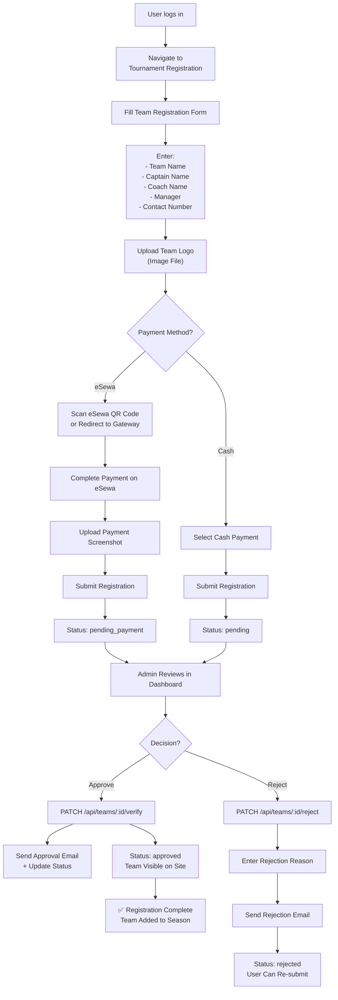
```mermaid
flowchart TD
    START["User logs in"] --> NAV["Navigate to\nTournament Registration"]
    NAV --> FORM["Fill Team Registration Form"]
    FORM --> DETAILS["Enter:\n- Team Name\n- Captain Name\n- Coach Name\n- Manager\n- Contact Number"]
    DETAILS --> LOGO["Upload Team Logo\n(Image File)"]
    LOGO --> PAYMENT{"Payment Method?"}

    PAYMENT -->|eSewa| QR["Scan eSewa QR Code\nor Redirect to Gateway"]
    QR --> PAY_DONE["Complete Payment on eSewa"]
    PAY_DONE --> RECEIPT["Upload Payment Screenshot"]
    RECEIPT --> SUBMIT["Submit Registration"]
    SUBMIT --> STATUS_PENDING["Status: pending_payment"]

    PAYMENT -->|Cash| CASH["Select Cash Payment"]
    CASH --> SUBMIT_CASH["Submit Registration"]
    SUBMIT_CASH --> STATUS_PENDING_CASH["Status: pending"]

    STATUS_PENDING --> ADMIN_REVIEW["Admin Reviews in Dashboard"]
    STATUS_PENDING_CASH --> ADMIN_REVIEW

    ADMIN_REVIEW --> DECISION{"Decision?"}
    DECISION -->|Approve| APPROVE["PATCH /api/teams/:id/verify"]
    DECISION -->|Reject| REJECT["PATCH /api/teams/:id/reject"]

    APPROVE --> EMAIL_APPROVE["Send Approval Email\n+ Update Status"]
    APPROVE --> STATUS_APPROVED["Status: approved\nTeam Visible on Site"]

    REJECT --> REASON["Enter Rejection Reason"]
    REASON --> EMAIL_REJECT["Send Rejection Email"]
    EMAIL_REJECT --> STATUS_REJECTED["Status: rejected\nUser Can Re-submit"]

    STATUS_APPROVED --> DONE["✅ Registration Complete\nTeam Added to Season"]
```

### 7.3 Live Scoring Workflow

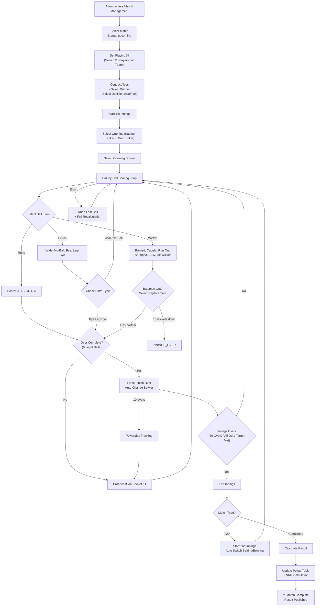
```mermaid
flowchart TD
    PREP["Admin enters Match Management"] --> SELECT_MATCH["Select Match\nStatus: upcoming"]
    SELECT_MATCH --> SETUP_XI["Set Playing XI\n(Select 11 Players per Team)"]

    SETUP_XI --> TOSS["Conduct Toss\n- Select Winner\n- Select Decision (Bat/Field)"]
    TOSS --> START_INNINGS["Start 1st Innings"]

    START_INNINGS --> SET_BATSMEN["Select Opening Batsmen\n(Striker + Non-Striker)"]
    SET_BATSMEN --> SET_BOWLER["Select Opening Bowler"]
    SET_BOWLER --> SCORE_LOOP["Ball-by-Ball Scoring Loop"]

    SCORE_LOOP --> BALL_EVENT{"Select Ball Event"}
    BALL_EVENT -->|Runs| RUNS["Score: 0, 1, 2, 3, 4, 6"]
    BALL_EVENT -->|Extras| EXTRAS["Wide, No-Ball, Bye, Leg-Bye"]
    BALL_EVENT -->|Wicket| WICKET["Bowled, Caught, Run Out,\nStumped, LBW, Hit Wicket"]

    RUNS --> CHECK_OVER{"Over Complete?\n(6 Legal Balls)"}
    EXTRAS --> CHECK_OVERS_EXTRA{"Check Extra Type"}
    CHECK_OVERS_EXTRA -->|Wide/No-Ball| SCORE_LOOP
    CHECK_OVERS_EXTRA -->|Bye/Leg-Bye| CHECK_OVER
    WICKET --> NEW_BATSMAN{"Batsman Out?\nSelect Replacement"}
    NEW_BATSMAN -->|10 wickets down| INNINGS_OVER
    NEW_BATSMAN -->|Has partner| CHECK_OVER

    CHECK_OVER -->|Yes| OVER_COMPLETE["Force Finish Over\nAuto Change Bowler"]
    CHECK_OVER -->|No| BROADCAST["Broadcast via Socket.IO"]
    OVER_COMPLETE -->|10 overs| POWERPLAY["Powerplay Tracking"]
    POWERPLAY --> BROADCAST
    BROADCAST --> SCORE_LOOP

    OVER_COMPLETE --> CHECK_INNINGS{"Innings Over?\n(20 Overs / All Out / Target Met)"}
    CHECK_INNINGS -->|No| SCORE_LOOP
    CHECK_INNINGS -->|Yes| END_INNINGS["End Innings"]

    END_INNINGS --> SWITCH{"Match Type?"}
    SWITCH -->|T20| SECOND_INNINGS["Start 2nd Innings\nAuto Switch Batting/Bowling"]
    SECOND_INNINGS --> SCORE_LOOP

    SWITCH -->|Completed| CALC_RESULT["Calculate Result"]
    CALC_RESULT --> UPDATE_POINTS["Update Points Table\n+ NRR Calculation"]
    UPDATE_POINTS --> MATCH_DONE["✅ Match Complete\nResult Published"]

    %% Failure paths
    SCORE_LOOP -->|Error| UNDO["Undo Last Ball\n+ Full Recalculation"]
    UNDO --> SCORE_LOOP
```

### 7.4 Player Verification Workflow

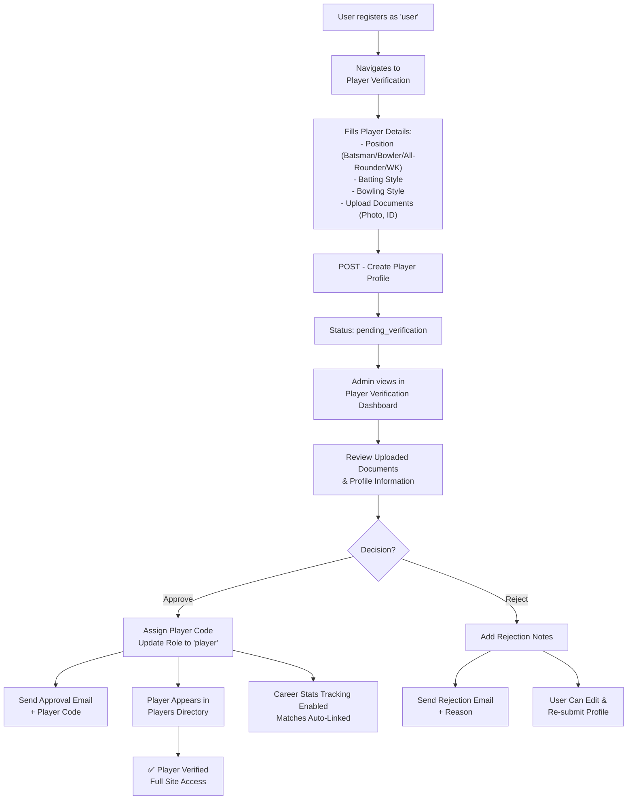
```mermaid
flowchart TD
    USER["User registers as 'user'"] --> SUBMIT["Navigates to\nPlayer Verification"]
    SUBMIT --> FORM["Fills Player Details:\n- Position (Batsman/Bowler/All-Rounder/WK)\n- Batting Style\n- Bowling Style\n- Upload Documents (Photo, ID)"]
    FORM --> API_CALL["POST - Create Player Profile"]
    API_CALL --> PENDING["Status: pending_verification"]

    PENDING --> ADMIN_REVIEW["Admin views in\nPlayer Verification Dashboard"]
    ADMIN_REVIEW --> REVIEW_DOCS["Review Uploaded Documents\n& Profile Information"]

    REVIEW_DOCS --> DECISION{"Decision?"}
    DECISION -->|Approve| APPROVE["Assign Player Code\nUpdate Role to 'player'"]
    DECISION -->|Reject| REJECT["Add Rejection Notes"]

    APPROVE --> EMAIL_APPROVE["Send Approval Email\n+ Player Code"]
    APPROVE --> PLAYER_VISIBLE["Player Appears in\nPlayers Directory"]
    APPROVE --> STATS_ENABLED["Career Stats Tracking Enabled\nMatches Auto-Linked"]

    REJECT --> EMAIL_REJECT["Send Rejection Email\n+ Reason"]
    REJECT --> CAN_RESUBMIT["User Can Edit &\nRe-submit Profile"]

    PLAYER_VISIBLE --> DONE["✅ Player Verified\nFull Site Access"]
```

### 7.5 News Management Workflow

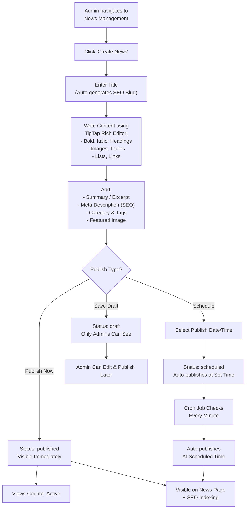
```mermaid
flowchart TD
    ADMIN["Admin navigates to\nNews Management"] --> CREATE["Click 'Create News'"]
    CREATE --> TITLE["Enter Title\n(Auto-generates SEO Slug)"]
    TITLE --> CONTENT["Write Content using\nTipTap Rich Editor:\n- Bold, Italic, Headings\n- Images, Tables\n- Lists, Links"]
    CONTENT --> META["Add:\n- Summary / Excerpt\n- Meta Description (SEO)\n- Category & Tags\n- Featured Image"]

    META --> STATUS{"Publish Type?"}
    STATUS -->|Publish Now| PUBLISH["Status: published\nVisible Immediately"]
    STATUS -->|Save Draft| DRAFT["Status: draft\nOnly Admins Can See"]
    STATUS -->|Schedule| SCHEDULE["Select Publish Date/Time"]
    SCHEDULE --> SCHEDULED["Status: scheduled\nAuto-publishes at Set Time"]

    PUBLISH --> VIEWS["Views Counter Active"]
    PUBLISH --> PUBLIC["Visible on News Page\n+ SEO Indexing"]

    DRAFT --> EDIT_LATER["Admin Can Edit & Publish Later"]
    SCHEDULED --> CRON_CHECK["Cron Job Checks\nEvery Minute"]
    CRON_CHECK --> AUTO_PUBLISH["Auto-publishes\nAt Scheduled Time"]
    AUTO_PUBLISH --> PUBLIC
```

### 7.6 Payment & eSewa Integration Workflow

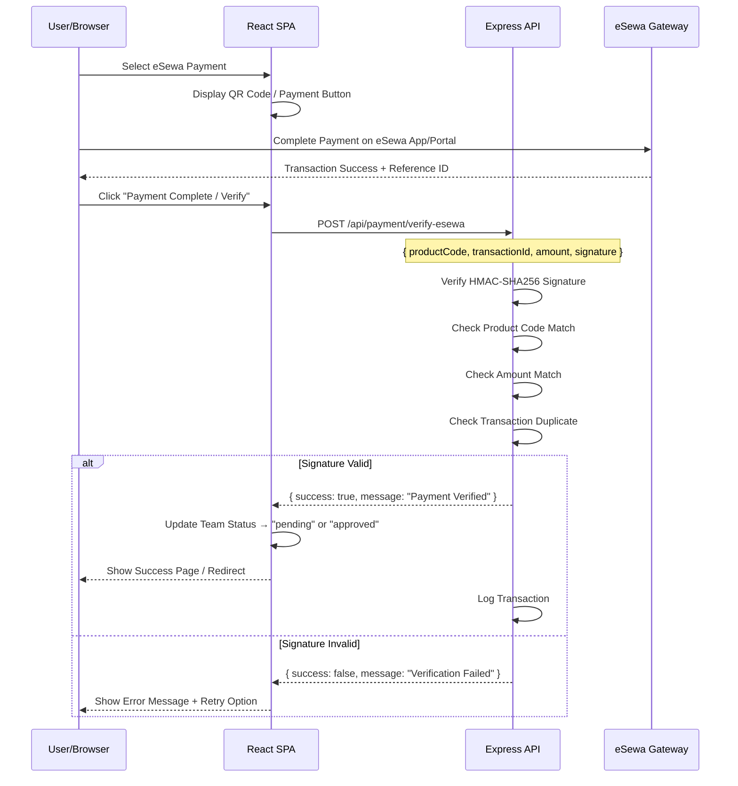
```mermaid
sequenceDiagram
    participant User as User/Browser
    participant Frontend as React SPA
    participant Backend as Express API
    participant eSewa as eSewa Gateway

    User->>Frontend: Select eSewa Payment
    Frontend->>Frontend: Display QR Code / Payment Button
    User->>eSewa: Complete Payment on eSewa App/Portal
    eSewa-->>User: Transaction Success + Reference ID

    User->>Frontend: Click "Payment Complete / Verify"
    Frontend->>Backend: POST /api/payment/verify-esewa
    Note over Backend: { productCode, transactionId, amount, signature }
    Backend->>Backend: Verify HMAC-SHA256 Signature
    Backend->>Backend: Check Product Code Match
    Backend->>Backend: Check Amount Match
    Backend->>Backend: Check Transaction Duplicate

    alt Signature Valid
        Backend-->>Frontend: { success: true, message: "Payment Verified" }
        Frontend->>Frontend: Update Team Status → "pending" or "approved"
        Frontend-->>User: Show Success Page / Redirect
        Backend->>Backend: Log Transaction
    else Signature Invalid
        Backend-->>Frontend: { success: false, message: "Verification Failed" }
        Frontend-->>User: Show Error Message + Retry Option
    end
```

---

## 8. Security Architecture

### 8.1 Security Layers


```mermaid
graph TB
    subgraph L1["Layer 1: Network Security"]
        CORS["CORS - Origin Whitelist"]
        HELMET["Helmet - HTTP Headers"]
        SSL["SSL/TLS - HTTPS Only"]
        PROXY["Trust Proxy - Load Balancer"]
    end

    subgraph L2["Layer 2: Authentication"]
        JWT["JWT Tokens\nRS256 / HS256"]
        BCRYPT["bcryptjs - Password Hashing\nSalt Rounds: 10"]
        OTP["OTP - Time-based\n+ Attempt Limiting"]
        SOCIAL["Social Auth Verification\ngoogle-auth-library"]
    end

    subgraph L3["Layer 3: Authorization"]
        ROLE_MID["Role-based Middleware\nsuper-admin / admin / player / user"]
        PROTECT["JWT Protect Middleware\nToken Verification"]
        ROUTE_GUARD["Route Guards\nFrontend Protected Routes"]
    end

    subgraph L4["Layer 4: Input Validation"]
        MONGOOSE["Mongoose Schema Validation\nField Types, Required, Enums"]
        ZOD["Zod - Request Body Validation\nType-safe Parsing"]
        SANITIZE["Input Sanitization\nXSS Prevention"]
    end

    subgraph L5["Layer 5: Data Security"]
        ENV["Environment Variables\nNo Hardcoded Secrets"]
        MONGO_URI["MongoDB URI\n+ IP Whitelist (Atlas)"]
        CLOUD_SEC["Cloudinary API Keys\nStored in .env"]
        ESEWA_SEC["eSewa Secret Key\nStored in .env"]
    end

    subgraph L6["Layer 6: Audit & Logging"]
        AUDIT["AuditLog Collection\nAdmin Actions Tracked"]
        MORGAN["Morgan - HTTP Request Log"]
        LOG_FILES["File Logging\nbackend.log + error.log"]
    end

    L1 --> L2 --> L3 --> L4 --> L5 --> L6
```

### 8.2 Authentication Flow (JWT)

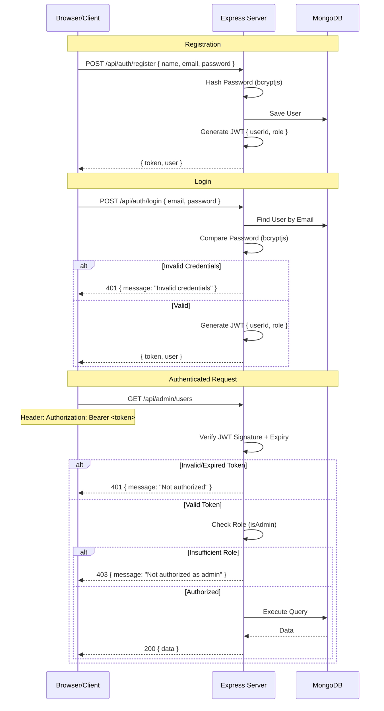
```mermaid
sequenceDiagram
    participant Client as Browser/Client
    participant Server as Express Server
    participant DB as MongoDB

    Note over Client,DB: Registration
    Client->>Server: POST /api/auth/register { name, email, password }
    Server->>Server: Hash Password (bcryptjs)
    Server->>DB: Save User
    Server->>Server: Generate JWT { userId, role }
    Server-->>Client: { token, user }

    Note over Client,DB: Login
    Client->>Server: POST /api/auth/login { email, password }
    Server->>DB: Find User by Email
    Server->>Server: Compare Password (bcryptjs)
    alt Invalid Credentials
        Server-->>Client: 401 { message: "Invalid credentials" }
    else Valid
        Server->>Server: Generate JWT { userId, role }
        Server-->>Client: { token, user }
    end

    Note over Client,DB: Authenticated Request
    Client->>Server: GET /api/admin/users
    Note over Client: Header: Authorization: Bearer <token>
    Server->>Server: Verify JWT Signature + Expiry
    alt Invalid/Expired Token
        Server-->>Client: 401 { message: "Not authorized" }
    else Valid Token
        Server->>Server: Check Role (isAdmin)
        alt Insufficient Role
            Server-->>Client: 403 { message: "Not authorized as admin" }
        else Authorized
            Server->>DB: Execute Query
            DB-->>Server: Data
            Server-->>Client: 200 { data }
        end
    end
```

### 8.3 Security Measures Checklist

| Security Measure | Status | Implementation |
|---|---|---|
| **Password Hashing** | ✅ | bcryptjs with salt rounds (configurable) |
| **JWT Authentication** | ✅ | JSON Web Tokens with expiry |
| **Role-based Access Control** | ✅ | Middleware chain: `protect → requireAdminOrSuperAdmin` |
| **CORS Whitelist** | ✅ | Configured allowed origins + localhost |
| **Helmet Security Headers** | ✅ | XSS, content-type, referrer policies |
| **Input Validation** | ✅ | Mongoose schema validation |
| **Environment Variables** | ✅ | All secrets in .env files |
| **OTP Attempt Limiting** | ✅ | Lockout after max attempts |
| **Social Token Verification** | ✅ | Google token verified server-side |
| **Audit Logging** | ✅ | All scoring changes logged |
| **eSewa Signature Verification** | ✅ | HMAC-SHA256 validation |

| Security Measure | Status | Recommendation |
|---|---|---|
| **Rate Limiting** | ⬜ Not Implemented | Add `express-rate-limit` — prevent brute force attacks |
| **MongoDB Sanitization** | ⬜ Not Implemented | Add `express-mongo-sanitize` — prevent NoSQL injection |
| **Request Validation Middleware** | ⬜ Partial | Add Zod validation on ALL endpoints |
| **XSS Sanitization** | ⬜ Partial | Add DOMPurify for rich text content |
| **HTTPS Enforcement** | ⬜ Auto (Vercel/Render) | Already handled by hosting providers |
| **CSP Headers** | ⬜ Not Configured | Add Content-Security-Policy headers |
| **SQL/NoSQL Injection** | ⬜ Partial | Mongoose provides basic protection |
| **2FA (Two Factor Auth)** | ⬜ Not Implemented | For admin accounts |
| **Session Management** | ⬜ Basic | JWT in localStorage (consider httpOnly cookies) |

### 8.4 Recommended Security Enhancements

```
npm install express-rate-limit express-mongo-sanitize
```

```javascript
// Rate Limiting
const rateLimit = require('express-rate-limit');
const limiter = rateLimit({
  windowMs: 15 * 60 * 1000, // 15 minutes
  max: 100, // limit each IP
  message: 'Too many requests, please try again later.'
});
app.use('/api', limiter);

// Auth routes stricter limit
const authLimiter = rateLimit({
  windowMs: 15 * 60 * 1000,
  max: 10,
  message: 'Too many auth attempts, please try again later.'
});
app.use('/api/auth', authLimiter);

// NoSQL Injection Prevention
const mongoSanitize = require('express-mongo-sanitize');
app.use(mongoSanitize());
```

---

## 9. Cost Breakdown

### 9.1 Development Cost Summary

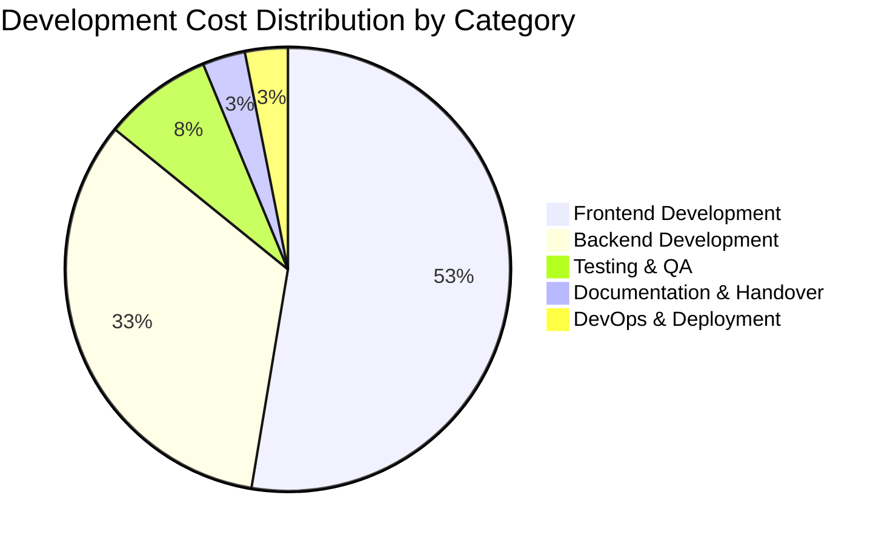
```mermaid
pie title Development Cost Distribution by Category
    "Frontend Development" : 8460
    "Backend Development" : 5340
    "Testing & QA" : 1275
    "Documentation & Handover" : 500
    "DevOps & Deployment" : 500
```

### 9.2 Detailed Cost Breakdown

| ID | Component | Category | Hours | Rate/hr | Cost (USD) | Cost (NPR) |
|---|---|---|---|---|---|---|
| **A. Frontend Development** | | | | | | |
| A01 | Project Setup & Architecture | Frontend | 20 | $20 | $400 | ₹54,000 |
| A02 | Authentication System (Login, Register, Forgot Password, Social Auth) | Frontend | 30 | $20 | $600 | ₹81,000 |
| A03 | Home Page & Landing (Hero, Stats, Updates) | Frontend | 16 | $20 | $320 | ₹43,200 |
| A04 | Teams Directory & Squad Pages | Frontend | 20 | $20 | $400 | ₹54,000 |
| A05 | Match Schedule & Details (Scorecard, Commentary) | Frontend | 25 | $20 | $500 | ₹67,500 |
| A06 | Live Scores Display (Socket.IO Integration) | Frontend | 30 | $20 | $600 | ₹81,000 |
| A07 | Points Table (Standings, NRR Display) | Frontend | 12 | $20 | $240 | ₹32,400 |
| A08 | News Section (List, Article, Featured) | Frontend | 20 | $20 | $400 | ₹54,000 |
| A09 | Photo Gallery (Albums, Grid, Fullscreen) | Frontend | 15 | $20 | $300 | ₹40,500 |
| A10 | Videos Section (Grid, Embeds) | Frontend | 8 | $20 | $160 | ₹21,600 |
| A11 | Sponsors Page (Tiered Display) | Frontend | 10 | $20 | $200 | ₹27,000 |
| A12 | Players Directory (Cards, Stats, Search) | Frontend | 15 | $20 | $300 | ₹40,500 |
| A13 | User Profile (Settings, Stats, History) | Frontend | 15 | $20 | $300 | ₹40,500 |
| A14 | Admin Dashboard (Stats, Charts, Activity) | Frontend | 20 | $20 | $400 | ₹54,000 |
| A15 | Admin: User Management (Table, CRUD, Roles) | Frontend | 15 | $20 | $300 | ₹40,500 |
| A16 | Admin: Team Management (Approval, Edit) | Frontend | 15 | $20 | $300 | ₹40,500 |
| A17 | Admin: Player Verification (Document Review) | Frontend | 12 | $20 | $240 | ₹32,400 |
| A18 | Admin: Match Management (CRUD, Results) | Frontend | 15 | $20 | $300 | ₹40,500 |
| A19 | Admin: Live Scoring UI (XI, Toss, Ball Entry, Undo) | Frontend | 40 | $20 | $800 | ₹108,000 |
| A20 | Admin: News Management (TipTap Editor) | Frontend | 20 | $20 | $400 | ₹54,000 |
| A21 | Admin: Gallery Management (Upload, Reorder) | Frontend | 15 | $20 | $300 | ₹40,500 |
| A22 | Admin: Video Management (CRUD) | Frontend | 8 | $20 | $160 | ₹21,600 |
| A23 | Admin: Sponsor Management (CRUD, Tiers) | Frontend | 12 | $20 | $240 | ₹32,400 |
| A24 | Admin: Settings & Config | Frontend | 10 | $20 | $200 | ₹27,000 |
| A25 | Tournament Registration (Multi-step Form) | Frontend | 20 | $20 | $400 | ₹54,000 |
| | **Frontend Subtotal** | | **423** | | **$8,460** | **₹1,142,100** |

| **B. Backend Development** | | | | | | |
|---|---|---|---|---|---|---|
| B01 | Server Setup (Express, Middleware, Security) | Backend | 15 | $20 | $300 | ₹40,500 |
| B02 | Database Design (18 Mongoose Models) | Backend | 25 | $20 | $500 | ₹67,500 |
| B03 | Auth API (Register, Login, Social, OTP, Reset) | Backend | 25 | $20 | $500 | ₹67,500 |
| B04 | Team & Player APIs (CRUD, Verification, Stats) | Backend | 20 | $20 | $400 | ₹54,000 |
| B05 | Match & Live Scoring APIs (Ball Engine, Undo) | Backend | 40 | $20 | $800 | ₹108,000 |
| B06 | Points Table Logic (NRR, Standings) | Backend | 15 | $20 | $300 | ₹40,500 |
| B07 | Season & Group Logic (Generate, Schedule) | Backend | 20 | $20 | $400 | ₹54,000 |
| B08 | News APIs (CRUD, External Fetch, Cron) | Backend | 15 | $20 | $300 | ₹40,500 |
| B09 | Gallery & Video APIs (CRUD, Cloudinary) | Backend | 12 | $20 | $240 | ₹32,400 |
| B10 | Sponsor APIs (Organization + Individual) | Backend | 10 | $20 | $200 | ₹27,000 |
| B11 | eSewa Payment Integration (Verify, Callback) | Backend | 20 | $20 | $400 | ₹54,000 |
| B12 | Socket.IO Real-time Server (Rooms, Broadcast) | Backend | 15 | $20 | $300 | ₹40,500 |
| B13 | Email Service (Nodemailer, Templates) | Backend | 10 | $20 | $200 | ₹27,000 |
| B14 | Admin APIs (Dashboard Stats, CRUD) | Backend | 15 | $20 | $300 | ₹40,500 |
| B15 | File Upload Service (Multer + Cloudinary) | Backend | 10 | $20 | $200 | ₹27,000 |
| B16 | Prediction & Voting APIs | Backend | 10 | $20 | $200 | ₹27,000 |
| B17 | Audit Logging System | Backend | 10 | $20 | $200 | ₹27,000 |
| | **Backend Subtotal** | | **287** | | **$5,740** | **₹774,900** |

| **C. DevOps & Deployment** | | | | | | |
|---|---|---|---|---|---|---|
| C01 | Vercel Frontend Deployment | DevOps | 5 | $20 | $100 | ₹13,500 |
| C02 | Render Backend Deployment | DevOps | 5 | $20 | $100 | ₹13,500 |
| C03 | MongoDB Atlas Setup & Config | DevOps | 3 | $20 | $60 | ₹8,100 |
| C04 | Cloudinary Account Setup | DevOps | 2 | $20 | $40 | ₹5,400 |
| C05 | Firebase Project & OAuth Setup | DevOps | 3 | $20 | $60 | ₹8,100 |
| C06 | Custom Domain & DNS Configuration | DevOps | 3 | $20 | $60 | ₹8,100 |
| C07 | CI/CD Pipeline (GitHub Auto-Deploy) | DevOps | 4 | $20 | $80 | ₹10,800 |
| | **DevOps Subtotal** | | **25** | | **$500** | **₹67,500** |

| **D. Testing & Quality Assurance** | | | | | | |
|---|---|---|---|---|---|---|
| D01 | API Endpoint Testing (80+ Endpoints) | QA | 20 | $15 | $300 | ₹40,500 |
| D02 | Frontend Component Testing | QA | 20 | $15 | $300 | ₹40,500 |
| D03 | Integration Testing (Full Flows) | QA | 15 | $15 | $225 | ₹30,375 |
| D04 | Mobile Responsiveness Testing | QA | 10 | $15 | $150 | ₹20,250 |
| D05 | Bug Fixing & Polish (Post-Testing) | QA | 20 | $15 | $300 | ₹40,500 |
| D06 | Payment Flow Testing (eSewa) | QA | 8 | $15 | $120 | ₹16,200 |
| D07 | Cross-browser Testing | QA | 8 | $15 | $120 | ₹16,200 |
| D08 | Load / Performance Testing | QA | 6 | $15 | $90 | ₹12,150 |
| | **Testing Subtotal** | | **107** | | **$1,605** | **₹216,675** |

| **E. Documentation & Handover** | | | | | | |
|---|---|---|---|---|---|---|
| E01 | Technical Documentation (API, Architecture) | Docs | 10 | $20 | $200 | ₹27,000 |
| E02 | User Manual (Admin + User Guide) | Docs | 10 | $20 | $200 | ₹27,000 |
| E03 | Source Code Handover (Clean Repo, README) | Docs | 5 | $20 | $100 | ₹13,500 |
| E04 | Admin Training Session (2 hrs) | Training | 4 | $20 | $80 | ₹10,800 |
| E05 | Video Tutorials Recording | Training | 6 | $20 | $120 | ₹16,200 |
| | **Documentation Subtotal** | | **35** | | **$700** | **₹94,500** |

### 9.3 Grand Total Summary

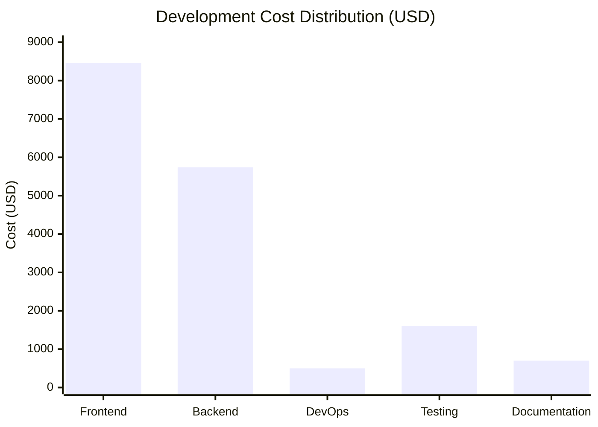
```mermaid
xychart-beta
    title "Development Cost Distribution (USD)"
    x-axis ["Frontend", "Backend", "DevOps", "Testing", "Documentation"]
    y-axis "Cost (USD)" 0 --> 9000
    bar [8460, 5740, 500, 1605, 700]
```

| Category | Hours | Cost (USD) | Cost (NPR) | Percentage |
|---|---|---|---|---|
| Frontend Development | 423 | $8,460 | ₹1,142,100 | 52.6% |
| Backend Development | 287 | $5,740 | ₹774,900 | 35.7% |
| Testing & QA | 107 | $1,605 | ₹216,675 | 10.0% |
| Documentation & Training | 35 | $700 | ₹94,500 | 4.4% |
| DevOps & Deployment | 25 | $500 | ₹67,500 | 3.1% |
| **Grand Total** | **877** | **$17,005** | **₹2,295,675** | **100%** |

### 9.4 Ongoing Monthly Costs

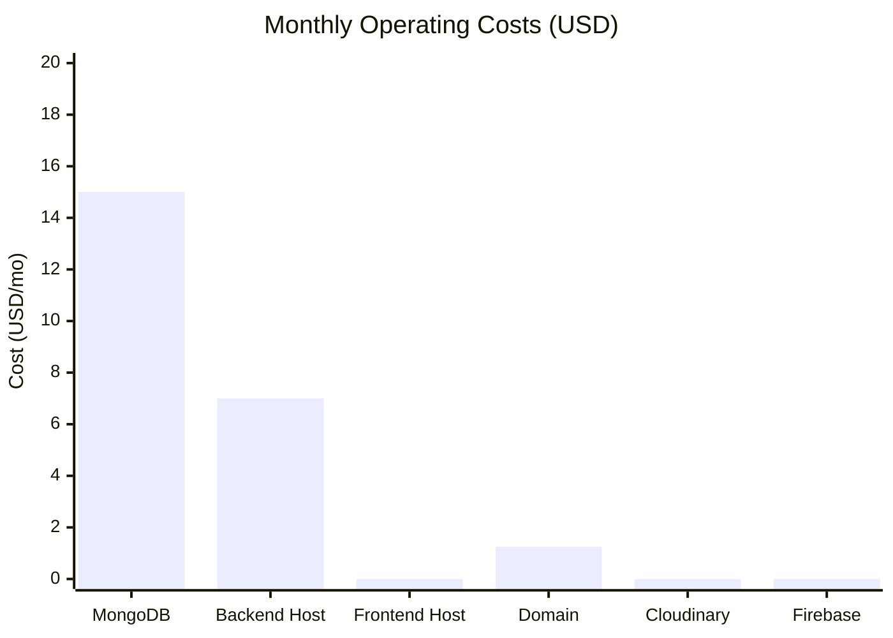
```mermaid
xychart-beta
    title "Monthly Operating Costs (USD)"
    x-axis ["MongoDB", "Backend Host", "Frontend Host", "Domain", "Cloudinary", "Firebase"]
    y-axis "Cost (USD/mo)" 0 --> 20
    bar [15, 7, 0, 1.25, 0, 0]
```

| Service | Recommended Plan | Monthly Cost (USD) | Monthly Cost (NPR) | Alternative Free Tier |
|---|---|---|---|---|
| MongoDB Atlas | M2 (2GB RAM, 2GB storage) | $15.00 | ₹2,025 | M0 (Free — 512MB, limited) |
| Backend Hosting | Render Starter (512MB RAM) | $7.00 | ₹945 | Render Free (sleeps after inactivity) |
| Frontend Hosting | Vercel Hobby | $0.00 | ₹0 | Free tier included |
| Media Storage | Cloudinary Free | $0.00 | ₹0 | 25GB storage, 25GB bandwidth |
| Social Auth | Firebase Spark | $0.00 | ₹0 | Free tier included |
| Email Service | Gmail SMTP / SendGrid Free | $0.00 | ₹0 | 100 emails/day free |
| Domain Renewal | .com.np / .com | $1.25 | ₹170 | — |
| SSL Certificate | Auto (Vercel + Render) | $0.00 | ₹0 | Included |
| **Total** | | **$23.25** | **~₹3,140** | **~$7/mo (with free tiers)** |

### 9.5 Optional Maintenance Packages

| Package | Monthly Cost (USD) | Monthly Cost (NPR) | Includes |
|---|---|---|---|
| **Basic** | $100 | ₹13,500 | Bug fixes, uptime monitoring, database backups, security patches |
| **Standard** | $200 | ₹27,000 | All Basic + content updates, small feature tweaks, 8 hrs dev/month |
| **Premium** | $400 | ₹54,000 | All Standard + 20 hrs dev/month, priority support, performance optimization |

---

## 10. Deployment Guide

### 10.1 Deployment Architecture

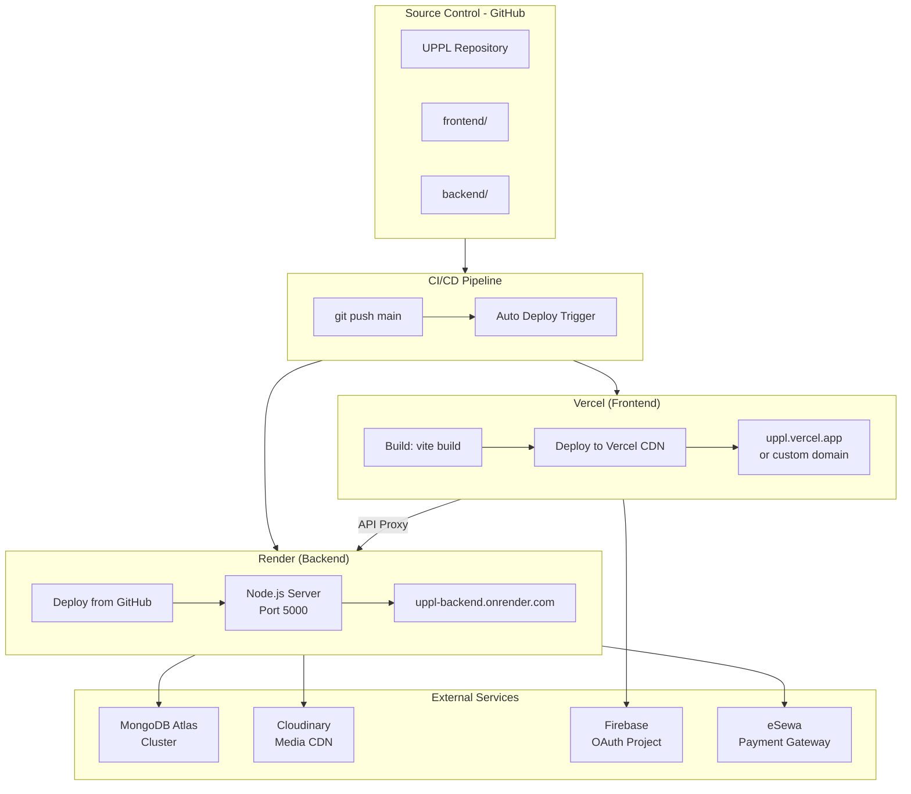
```mermaid
graph TB
    subgraph GIT["Source Control - GitHub"]
        REPO["UPPL Repository"]
        FRONTEND_CODE["frontend/"]
        BACKEND_CODE["backend/"]
    end

    subgraph CI["CI/CD Pipeline"]
        GIT_PUSH["git push main"] --> AUTO_DEPLOY["Auto Deploy Trigger"]
    end

    subgraph VERCEL["Vercel (Frontend)"]
        V_BUILD["Build: vite build"]
        V_BUILD --> V_DEPLOY["Deploy to Vercel CDN"]
        V_DEPLOY --> V_DOMAIN["uppl.vercel.app\nor custom domain"]
    end

    subgraph RENDER["Render (Backend)"]
        R_BUILD["Deploy from GitHub"]
        R_BUILD --> R_DEPLOY["Node.js Server\nPort 5000"]
        R_DEPLOY --> R_DOMAIN["uppl-backend.onrender.com"]
    end

    subgraph SERVICES["External Services"]
        MONGO_ATLAS["MongoDB Atlas\nCluster"]
        CLOUDINARY["Cloudinary\nMedia CDN"]
        FIREBASE["Firebase\nOAuth Project"]
        ESEWA_SRV["eSewa\nPayment Gateway"]
    end

    GIT --> CI
    CI --> VERCEL
    CI --> RENDER
    VERCEL -->|API Proxy| RENDER
    RENDER --> MONGO_ATLAS
    RENDER --> CLOUDINARY
    RENDER --> ESEWA_SRV
    VERCEL --> FIREBASE
```

### 10.2 Prerequisites

Before deployment, ensure you have accounts and access to:

| Service | Account Required | URL |
|---|---|---|
| GitHub | Repository hosting | https://github.com |
| Vercel | Frontend deployment | https://vercel.com |
| Render | Backend deployment | https://render.com |
| MongoDB Atlas | Database hosting | https://mongodb.com/atlas |
| Cloudinary | Media storage | https://cloudinary.com |
| Firebase | Social authentication | https://console.firebase.google.com |
| eSewa | Payment gateway (Nepal) | https://esewa.com.np |
| Domain Registrar | Custom domain | e.g., https://namecheap.com |

### 10.3 Environment Variables

#### Backend (`backend/.env`)

```env
# Server Configuration
PORT=5000
NODE_ENV=production

# MongoDB
MONGO_URI=mongodb+srv://<username>:<password>@<cluster>.mongodb.net/uppl?retryWrites=true&w=majority

# JWT
JWT_SECRET=<generate-a-strong-random-secret>
JWT_EXPIRES_IN=30d

# Frontend URL (for CORS)
FRONTEND_URL=https://your-domain.com
ALLOWED_ORIGINS=https://your-domain.com

# Cloudinary
CLOUDINARY_CLOUD_NAME=your-cloud-name
CLOUDINARY_API_KEY=your-api-key
CLOUDINARY_API_SECRET=your-api-secret

# eSewa
ESEWA_PRODUCT_CODE=your-product-code
ESEWA_SECRET_KEY=your-secret-key

# Email (Gmail SMTP or SendGrid)
EMAIL_USER=your-email@gmail.com
EMAIL_PASS=your-app-password

# NewsAPI
NEWS_API_KEY=your-newsapi-key

# Firebase (for server-side verification)
GOOGLE_CLIENT_ID=your-google-client-id
```

#### Frontend (`frontend/.env`)

```env
VITE_API_URL=https://your-backend-url.com/api
VITE_BASE_URL=https://your-backend-url.com
VITE_GOOGLE_CLIENT_ID=your-google-client-id
VITE_FACEBOOK_APP_ID=your-facebook-app-id
```

### 10.4 Step-by-Step Deployment

#### Step 1: MongoDB Atlas Setup
```
1. Go to https://cloud.mongodb.com
2. Create new cluster (M0 free or M2 production)
3. Create database user (username + password)
4. IP Whitelist: 0.0.0.0/0 (allow all) or Render IPs
5. Get connection string → set as MONGO_URI
```

#### Step 2: Cloudinary Setup
```
1. Go to https://cloudinary.com
2. Create account / project
3. Get Cloud Name, API Key, API Secret from Dashboard
4. Create upload preset (unsigned) for direct uploads
```

#### Step 3: Firebase Setup (Social Auth)
```
1. Go to Firebase Console → Create Project
2. Enable Authentication → Sign-in methods → Google + Facebook
3. Get Web App config (API Key, Auth Domain, etc.)
4. For Google: Get Web Client ID from GCP Console
5. For Facebook: Get App ID from Facebook Developers
```

#### Step 4: Deploy Backend to Render
```
1. Push code to GitHub repository
2. Go to https://dashboard.render.com
3. New + → Web Service → Connect GitHub repo
4. Settings:
   - Name: uppl-backend
   - Root Directory: backend
   - Runtime: Node
   - Build Command: npm install
   - Start Command: node server.js
   - Node Version: 18
5. Add all environment variables from .env
6. Deploy → Auto-deploys on git push
```

#### Step 5: Deploy Frontend to Vercel
```
1. Go to https://vercel.com
2. New Project → Import GitHub repo
3. Settings:
   - Root Directory: frontend
   - Framework: Vite
   - Build Command: npm run build
   - Output: dist
4. Add frontend environment variables (VITE_*)
5. Deploy → Auto-deploys on git push
6. Configure vercel.json for API proxy:
   {
     "rewrites": [
       { "source": "/api/(.*)", "destination": "https://uppl-backend.onrender.com/api/$1" },
       { "source": "/(.*)", "destination": "/" }
     ]
   }
```

#### Step 6: Custom Domain Setup
```
1. Purchase domain from registrar
2. Vercel: Go to project → Domains → Add custom domain
3. Add CNAME record @ → cname.vercel-dns.com
4. Render: Go to dashboard → Settings → Custom Domain
5. Add CNAME record api.yourdomain.com → your-render-app.onrender.com
6. SSL auto-provisioned by Vercel/Render (Let's Encrypt)
```

#### Step 7: Post-Deployment Verification

- [ ] Test login/registration
- [ ] Test Google/Facebook social login
- [ ] Create a test season
- [ ] Register a test team (with payment)
- [ ] Create a match and test live scoring
- [ ] Verify points table calculation
- [ ] Test file uploads (images, logos)
- [ ] Test email notifications
- [ ] Test all admin features
- [ ] Test mobile responsiveness

---

## 11. Maintenance Plan

### 11.1 Maintenance Schedule

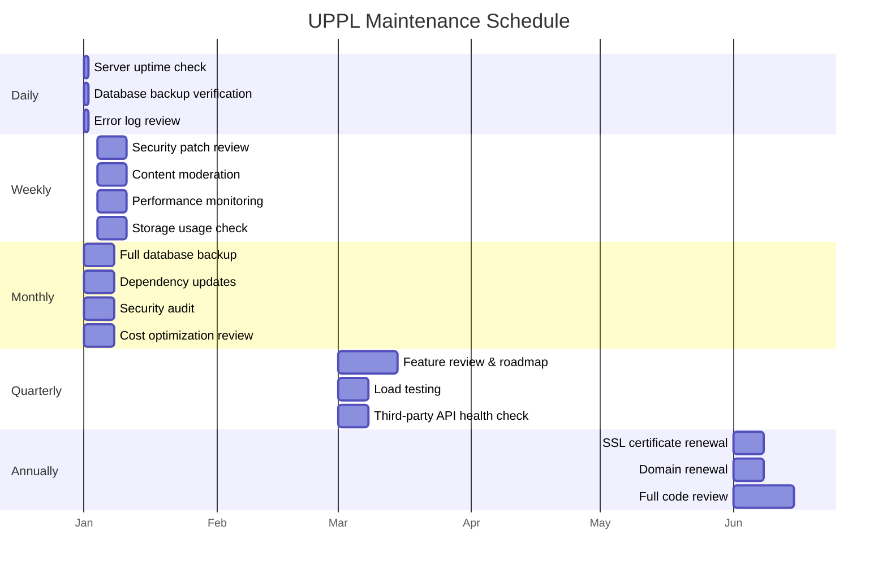
```mermaid
gantt
    title UPPL Maintenance Schedule
    dateFormat  YYYY-MM-DD
    axisFormat  %b

    section Daily
    Server uptime check           :d1, 2026-01-01, 1d
    Database backup verification  :d2, 2026-01-01, 1d
    Error log review              :d3, 2026-01-01, 1d

    section Weekly
    Security patch review         :w1, 2026-01-04, 1w
    Content moderation            :w2, 2026-01-04, 1w
    Performance monitoring        :w3, 2026-01-04, 1w
    Storage usage check           :w4, 2026-01-04, 1w

    section Monthly
    Full database backup          :m1, 2026-01-01, 1w
    Dependency updates            :m2, 2026-01-01, 1w
    Security audit                :m3, 2026-01-01, 1w
    Cost optimization review      :m4, 2026-01-01, 1w

    section Quarterly
    Feature review & roadmap      :q1, 2026-03-01, 2w
    Load testing                  :q2, 2026-03-01, 1w
    Third-party API health check  :q3, 2026-03-01, 1w

    section Annually
    SSL certificate renewal       :a1, 2026-06-01, 1w
    Domain renewal                :a2, 2026-06-01, 1w
    Full code review              :a3, 2026-06-01, 2w
```

### 11.2 Maintenance Tasks Breakdown

| Frequency | Task | Description | Estimated Time | Criticality |
|---|---|---|---|---|
| **Daily** | Server Uptime Check | Verify frontend + backend are responding (UptimeRobot) | 5 min | High |
| **Daily** | Error Log Review | Check backend.log + backend_err.log for anomalies | 10 min | High |
| **Daily** | Live Score Monitoring | Verify active matches have correct scoring | 5 min | Medium |
| **Weekly** | Security Patches | Apply npm audit fixes, update vulnerable packages | 30 min | High |
| **Weekly** | Content Moderation | Review/approve news, gallery, player verifications | 30 min | Medium |
| **Weekly** | Storage Check | Monitor Cloudinary + MongoDB storage usage | 10 min | Low |
| **Monthly** | Database Backup | Export MongoDB collections to JSON backup | 20 min | High |
| **Monthly** | Dependency Updates | Update npm packages (minor + patch) | 1 hr | Medium |
| **Monthly** | Performance Review | Check API response times, page load speeds | 30 min | Medium |
| **Monthly** | Cost Review | Review hosting costs, optimize if needed | 15 min | Low |
| **Quarterly** | Load Testing | Simulate traffic during tournament peak | 2 hr | Medium |
| **Quarterly** | API Health Check | Verify third-party integrations (eSewa, NewsAPI, Cloudinary) | 30 min | High |
| **Annually** | SSL Certificate | Verify/renew auto-provisioned certificates | 15 min | High |
| **Annually** | Domain Renewal | Renew domain registration | 15 min | High |
| **Annually** | Full Code Review | Comprehensive security + performance audit | 4 hr | Medium |

### 11.3 Responsiveness Matrix

```mermaid
flowchart TD
    ISSUE["Issue Reported"] --> SEVERITY{"Severity Level?"}
    SEVERITY -->|Critical| CRITICAL["System Down / Data Loss\nPayment Failure"]
    SEVERITY -->|High| HIGH["Feature Broken\nMajor UI Issue"]
    SEVERITY -->|Medium| MEDIUM["Minor Feature Issue\nCosmetic Bug"]
    SEVERITY -->|Low| LOW["Enhancement Request\nMinor Polish"]

    CRITICAL --> RESP_CRIT["Response: < 1 hour\nResolution: < 4 hours"]
    HIGH --> RESP_HIGH["Response: < 4 hours\nResolution: < 24 hours"]
    MEDIUM --> RESP_MED["Response: < 24 hours\nResolution: < 72 hours"]
    LOW --> RESP_LOW["Response: < 1 week\nResolution: Next sprint"]

    RESP_CRIT --> ESCALATE["Emergency Call\n+ Dev Team"]
    RESP_HIGH --> PRIORITY["Priority Queue\nNext-Day Fix"]
    RESP_MED --> SCHEDULE["Schedule in\nWeekly Sprint"]
    RESP_LOW --> BACKLOG["Add to\nFeature Backlog"]
```

### 11.4 Service Level Agreement (SLA) — Recommended

| Metric | Target |
|---|---|
| **Uptime** | 99.5% (excluding scheduled maintenance) |
| **Response Time (Critical)** | < 1 hour |
| **Response Time (High)** | < 4 hours |
| **Response Time (Medium)** | < 24 hours |
| **Bug Fix (Critical)** | < 4 hours |
| **Bug Fix (High)** | < 24 hours |
| **Backup Frequency** | Daily (automated) |
| **Backup Retention** | 30 days |

---

## 12. Handover Checklist

### 12.1 Source Code Handover

| Item | Status | Notes |
|---|---|---|
| GitHub Repository Access | ⬜ | Private repo with admin rights for client |
| Full Git History | ✅ | All commits preserved |
| `.gitignore` Configured | ✅ | Secrets excluded from version control |
| `README.md` with Setup Instructions | ✅ | Basic instructions included |
| `AGENTS.md` (AI Build Instructions) | ✅ | For reference |
| License File | ⬜ | Recommend adding MIT or custom license |
| Code Comments (Critical Sections) | ⬜ | Partial — add more if needed |

### 12.2 Access & Credentials Handover

| Item | Status | Notes |
|---|---|---|
| Super Admin Login Credentials | ⬜ | Create and share securely |
| MongoDB Atlas Read-Only Access | ⬜ | Create read-only database user |
| MongoDB Atlas Full Access | ⬜ | Admin user for backups |
| Cloudinary Dashboard Access | ⬜ | Share account or create sub-account |
| Firebase Console Access | ⬜ | Add client email as project viewer |
| Vercel Dashboard Access | ⬜ | Add as team member |
| Render Dashboard Access | ⬜ | Add as team member |
| Domain Registrar Access | ⬜ | Transfer or share access |
| eSewa Merchant Dashboard | ⬜ | Business account access |
| NewsAPI Account Access | ⬜ | API key in env file |
| Email Account Access | ⬜ | Gmail/SendGrid credentials |

### 12.3 Documentation Handover

| Item | Status | Notes |
|---|---|---|
| Technical Architecture Document | ⬜ | This document |
| API Endpoint Documentation | ⬜ | Recommend Swagger/OpenAPI |
| Database Schema Documentation | ⬜ | Included in this document |
| Deployment Guide | ⬜ | Included in this document |
| Admin User Manual | ⬜ | Step-by-step admin guide |
| User Guide | ⬜ | Public user feature guide |
| Troubleshooting Guide | ⬜ | Common issues & fixes |
| Video Tutorials | ⬜ | Recorded admin workflows |

### 12.4 Training & Knowledge Transfer

| Item | Duration | Status |
|---|---|---|
| **Admin Training Session 1:** Dashboard & User Management | 1 hr | ⬜ |
| **Admin Training Session 2:** Match Management & Live Scoring | 2 hr | ⬜ |
| **Admin Training Session 3:** Content Management (News, Gallery, Videos, Sponsors) | 1 hr | ⬜ |
| **Admin Training Session 4:** Payments, Seasons & Settings | 1 hr | ⬜ |
| **Q&A Session** | 1 hr | ⬜ |
| **Recorded Video Walkthroughs** | — | ⬜ |

### 12.5 Pre-Launch Verification Checklist

- [ ] **Authentication:** Register, Login, Social Login, Forgot Password all working
- [ ] **Teams:** Registration, approval, squad display working
- [ ] **Matches:** Create, schedule, group assignment working
- [ ] **Live Scoring:** Full ball-by-ball flow tested (runs, wickets, extras, overs, innings)
- [ ] **Points Table:** Standings calculated correctly after matches
- [ ] **Payments:** eSewa integration tested end-to-end
- [ ] **News:** Create, publish, edit, featured image working
- [ ] **Gallery:** Upload, album, fullscreen view working
- [ ] **Videos:** YouTube/Vimeo embeds working
- [ ] **Sponsors:** All tiers displaying correctly
- [ ] **Predictions/Voting:** Match predictions and player voting working
- [ ] **Email:** Verification/rejection/OTP emails being delivered
- [ ] **Mobile:** All pages responsive on mobile, tablet, desktop
- [ ] **Performance:** Page load under 3 seconds on 3G
- [ ] **Security:** JWT, CORS, Helmet, rate limiting (if added) working
- [ ] **SEO:** Meta tags, Open Graph images, sitemap working
- [ ] **HTTPS:** SSL certificate valid on all domains
- [ ] **Analytics:** Google Analytics / tracking code added (optional)
- [ ] **Backup:** Automated database backup configured

### 12.6 Post-Launch Support Period

| Item | Duration | Included |
|---|---|---|
| **Bug Fix Support** | 30 days post-launch | ✅ Critical & High priority bugs |
| **Uptime Monitoring** | 30 days post-launch | ✅ 24/7 monitoring |
| **Emergency Support** | 30 days post-launch | ✅ Phone/WhatsApp access |
| **Feature Requests** | — | ⬜ Quoted separately |
| **Extended Support** | After 30 days | Monthly maintenance package |

---

## 13. Appendices

### Appendix A: Feature Comparison — UPPL vs. Competitors

| Feature | UPPL | CricClubs | Play-Cricket | Manual System |
|---|---|---|---|---|
| Live Ball-by-Ball Scoring | ✅ | ✅ | ✅ | ❌ |
| Real-time WebSocket Updates | ✅ | ❌ (Polling) | ❌ | ❌ |
| eSewa Payment Integration | ✅ | ❌ | ❌ | ❌ |
| Photo/Video Gallery | ✅ | ❌ | ❌ | ❌ |
| Sponsor Management | ✅ | ❌ | ❌ | ❌ |
| Match Predictions | ✅ | ❌ | ❌ | ❌ |
| Player Career Stats | ✅ | ❌ | ❌ | ❌ |
| Social Login | ✅ | ❌ | ❌ | ❌ |
| Auto Group/Schedule Generator | ✅ | ✅ | ❌ | ❌ |
| Free & Open Source | ✅ (Custom Build) | ❌ (Paid SaaS) | ❌ (Paid) | N/A |
| Mobile App | ❌ (v2) | ✅ | ✅ | ❌ |
| Multi-language | ❌ (v2) | ❌ | ❌ | ❌ |

### Appendix B: Technology Justification

| Technology | Why We Chose It | Alternatives Considered |
|---|---|---|
| **React** | Largest ecosystem, reusable components, TypeScript support | Vue, Angular, Svelte |
| **TypeScript** | Type safety reduces runtime errors, better maintainability | JavaScript (plain) |
| **Vite** | Fastest build tool (10x faster than CRA), modern ESM | Create React App, Next.js |
| **Tailwind CSS** | Rapid prototyping, consistent design system, small bundle | Bootstrap, Material-UI |
| **MongoDB** | Flexible schema for tournament data, fast iteration, JSON-native | PostgreSQL, MySQL |
| **Express** | Minimal, well-known, large middleware ecosystem | Fastify, NestJS, Koa |
| **Socket.IO** | Reliable WebSocket with fallback, room support, auto-reconnect | Pusher, native WebSocket |
| **Cloudinary** | Built-in CDN, image transformations, free tier available | AWS S3, Cloudinary vs imgix |
| **eSewa** | Only widely-used Nepal payment gateway | Khalti, ConnectIPS |
| **Vercel + Render** | Free tiers, auto-SSL, git-based deploy | AWS, Heroku, DigitalOcean |

### Appendix C: Recommended v2 Features (Roadmap)

| Feature | Estimated Effort | Estimated Cost | Priority |
|---|---|---|---|
| **Progressive Web App (PWA)** — Installable on mobile | 40 hrs | $800 | High |
| **Multi-language (Nepali + English)** | 60 hrs | $1,200 | High |
| **WhatsApp / SMS Notifications** | 25 hrs | $500 | High |
| **Live Streaming Integration** (YouTube Live embed) | 15 hrs | $300 | Medium |
| **Match Commentary Feed** (auto-generated text) | 20 hrs | $400 | Medium |
| **Scorecard Export as Image/PDF** | 10 hrs | $200 | Low |
| **Fantasy League Module** | 150 hrs | $3,000 | Low |
| **Mobile App (React Native)** | 300 hrs | $6,000 | Medium |
| **Advanced Analytics & Reports** | 40 hrs | $800 | Low |
| **Tournament Chat/Forum** | 20 hrs | $400 | Low |

### Appendix D: Glossary

| Term | Definition |
|---|---|
| **NRR** | Net Run Rate — used to break ties in tournament standings |
| **Powerplay** | First 6 overs of T20 innings with fielding restrictions |
| **T20** | Twenty20 — 20 overs per side cricket format |
| **JWT** | JSON Web Token — stateless authentication token |
| **JWT** | JSON Web Token |
| **Socket.IO** | Real-time bidirectional WebSocket library |
| **ODM** | Object Document Mapper (Mongoose for MongoDB) |
| **CDN** | Content Delivery Network — globally distributed static assets |
| **SPA** | Single Page Application — client-side rendered React app |
| **CORS** | Cross-Origin Resource Sharing — browser security policy |
| **eSewa** | Nepali digital payment gateway |
| **SMTP** | Simple Mail Transfer Protocol — email sending |
| **CRUD** | Create, Read, Update, Delete — basic data operations |
| **SEO** | Search Engine Optimization |
| **SSL/TLS** | Secure Sockets Layer / Transport Layer Security — encryption |

---

## Document Control

| Version | Date | Author | Changes |
|---|---|---|---|
| 1.0 | June 2026 | [Your Name] | Initial client delivery document |

---

*This document is confidential and intended for the UPPL management team.*  
*For technical support, contact: [Your Email] | [Your Phone]*
